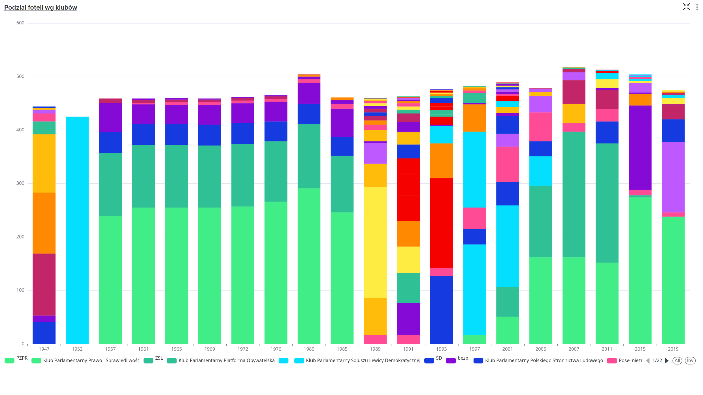
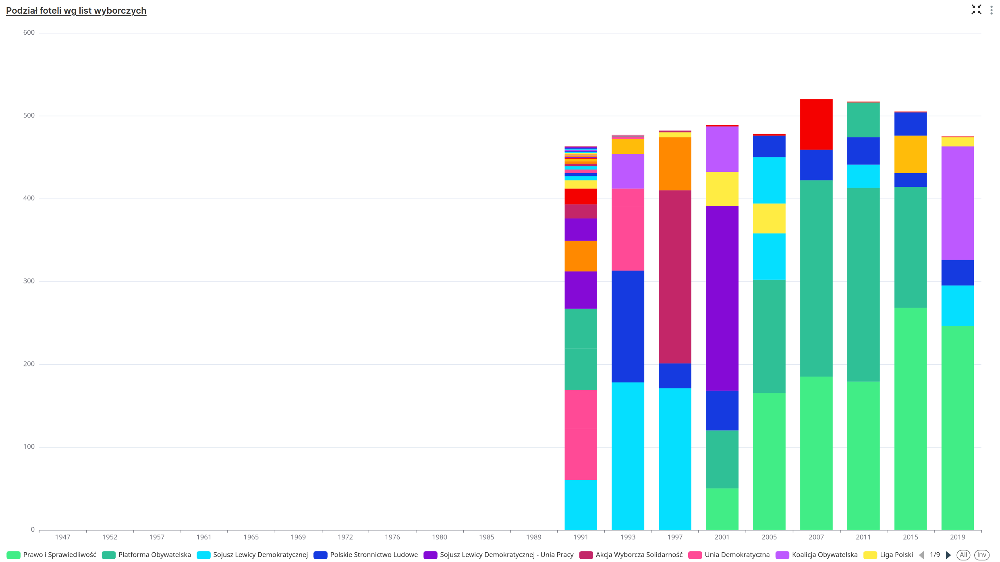
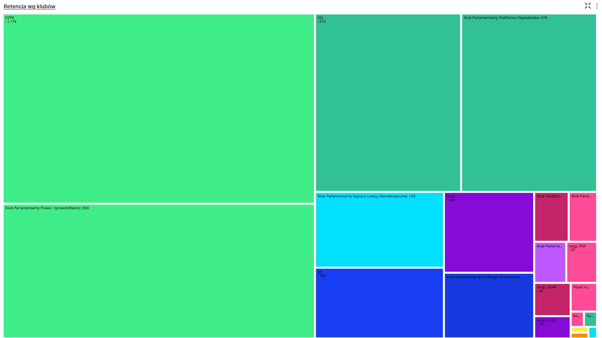
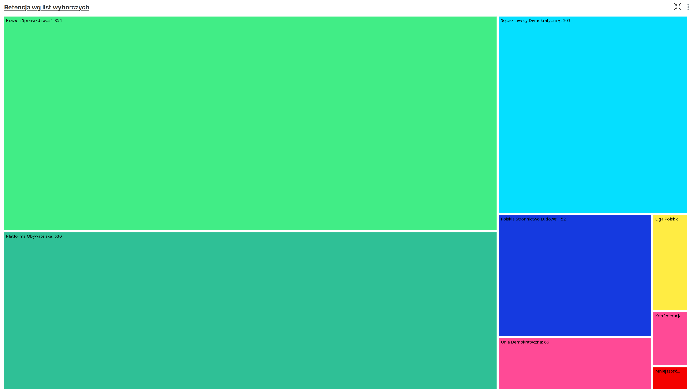
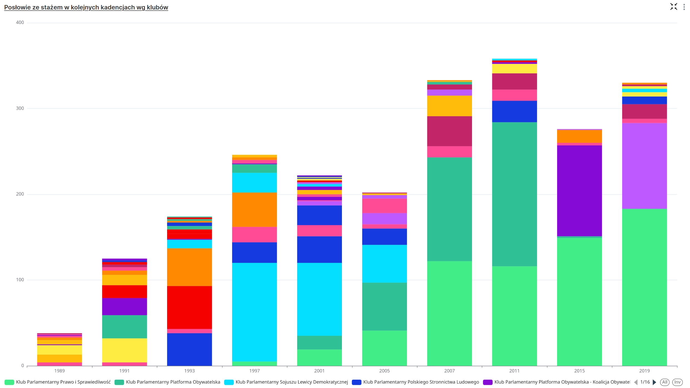
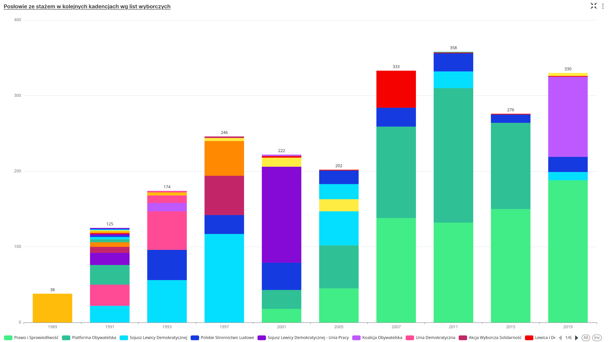
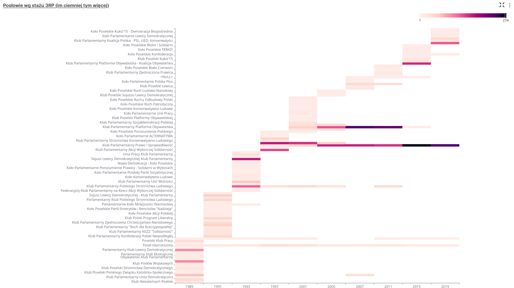

# Statystyki sejmowe

# Po co to komu

Chciałem sobie samemu udzielić odpowiedzi na następujące pytania:
- Czy w rządzie na prawdę cały czas siedzą ci sami ludzie?
- Jeśli tak to kto? (Z jakich partii? W jakich partiach są obecnie? Co z postkomuną?)
- Jakie są przesunięcia między partiami? (farbowane lisy)

# Wyniki

W katalogu `/wykresy` znajdują się zrzuty ekranów dla wszystkich wykresów jakie przygotowałem po drodze.

### 01_A_staz

- wykres ilości miejsc w sejmi z podziałem na *kluby*
- wykres przedstawia ilość miejsc w sejmie, a nie proporcje zdobytych głosów (fałszerstwa PPR + system d'Honta)
- pierwszy słupek to Sejm Ustawodawczy. Na oko wygląda tak jakby był pluralizm, ale 80% to "Blok Demokratyczny" (PPS, PPR, SL, SD)
- między 2001 - 2011 Platforma Obywatelska zaznaczona jest kolorem ciemnozielonym, potem jest widoczna w różnych odcieniach fioletowego ponieważ koło zmieniało nazwę co kadencję

### 01_B_staz

- wykres ilości miejsc w sejmi z podziałem na *listy wyborcze*
- na stronie sejm.gov.pl nie znalazłem informacji o listach wyborczych z PRL, więc ta część wykresu jest pusta

### 02_A_retencja

- wykres przedstawia poziom retencji posłów z podziałem na *kluby*
- rozmiar prostokątów zależny jest od ilości posłów, któży byli już wcześniej posłami
- rozmiar prostokątów jest zależny od tego ile kadencji łącznie przepracował dany poseł
- (3 posłów z 1+1 kadencji, to to samo co 1 poseł z 1+3 kadencji)
- te same uwagi co do kolorów PO, oraz czasów PRL co wyżej

### 02_B_retencja

- wykres przedstawia poziom retencji posłów z podziałem na *listy wyborcze*
- te same uwagi co do kolorów PO, oraz czasów PRL co wyżej

### 03_A_staz

### 03_B_staz
- wykres przedstawia poziom retencji posłów z podziałem na *kluby* w kolejnych kadencjach

- wykres przedstawia poziom retencji posłów z podziałem na *listy wyborcze* w kolejnych kadencjach

### 03_B_staz
- wykres przedstawia poziom retencji posłów z podziałem na *listy wyborcze* w kolejnych kadencjach

### 04_A_heatmap

- mapa cieplna dla danych z wykresu 02_B_staz.png

### Rekordziści
W plikach `rekordzisci_3rp.csv` oraz `rekordzisci_prl.csv` znajdują się listy posłów z najdłuższym stażem.

Top 10 dla IIIRP:
|posel                |ilosc_kadencji|dane Lista                  |
|---------------------|--------------|----------------------------|
|Marek Sawicki        |    7         |Polskie Stronnictwo Ludowe  |
|Jarosław Kaczyński   |    6         |Prawo i Sprawiedliwość      |
|Jerzy Polaczek       |    6         |Prawo i Sprawiedliwość      |
|Marek Suski          |    6         |Prawo i Sprawiedliwość      |
|Adam Lipiński        |    6         |Prawo i Sprawiedliwość      |
|Marek Kuchciński     |    6         |Prawo i Sprawiedliwość      |
|Mieczysław Kasprzak  |    6         |Polskie Stronnictwo Ludowe  |
|Stanisław Żelichowski|    5         |Polskie Stronnictwo Ludowe  |
|Witold Czarnecki     |    5         |Prawo i Sprawiedliwość      |
|Krystyna Łybacka     |    5         |Sojusz Lewicy Demokratycznej|

Top 10 dla PRL:
|posel                |ilosc_kadencji|
|---------------------|--------------|
|Józef Cyrankiewicz   |    6         |
|Czesław Wycech       |    6         |
|Bolesław Podedworny  |    6         |
|Kazimierz Banach     |    6         |
|Jan Frankowski       |    6         |
|Marian Jaworski      |    6         |
|Jan Karol Wende      |    6         |
|Lucjan Motyka        |    6         |
|Stanisław Kulczyński |    6         |

# Jak można samemu wygenerować raporty

## Najłatwiej
- pobierz plik `orka_sejm_gov_pl.ods` - arkusz kalkulacyjny przyjacielem twym

## Ambitniej (wszystkie kroki są opcjonalne i można zacząć od dowolnego momentu)
1. Scraper
- W katalogu `./puppeteer-scraper/` znajduje się scraper strony `orka.sejm.gov.pl`, która jest archiwum danych o posałach z poprzednich kadencji (na liście nie ma obecnej kadencji)
- przed pierwszym uruchomieniem skryptu uruchom: `npm install`
- do pobrania całej zawartości uruchom: `node scrapeWithCaptcha.js`
- otworzy się Chrome. Jeśli wyskoczy CAPTCHA trzeba ją ręcznie wpisać i nacisnąć spację w konsoli
- całość (ok 10 tysięcy) stron pobiera się ok 20 minut

2. HTML -> JSON
- w katalogu `./gov.pl_to_json/` jest mały skrypt, który wyciąga z HTML dane, których można potem użyć do generowania raportów
- przed pierwszym uruchomieniem: `npm install`
- a potem: `node index.js`
- w pliku `output.json` pojawią się zaktualizowane dane.
  - Ten plik już jest w repozytorium i nie powinien się zmienić przed końcem kadencji (inaczej oznaczałoby to że ktoś gmera w historycznych danych dot. posłów)

3. JSON -> CVS
- Żeby przerobić plik tekstowy z dużą ilośćią wąsów {} na tabelę można użyć jakiegoś narzędzia online, AI, albo tak jak ja zaimportować dane do NocoDB
- do surowej tabelki dorzuciłem jeszcze ręcznie kolumnę z chronologią (sortowanie po nazwie kadencji jest zawodne)
- plik zawierający wszystkie dane znajduje się pod: `./orka_sejm_gov_pl.csv`
- plik CSV polecam zaimportować do MySQL/PostgreSQL tak żeby można było użyć tych danych w Apache Superset

4. raporty w Apache Superset
- wszystkie widoki można łatwo samemu wyklikać, ale w tym repozytorium znajduje się plik `./dashboard_export_20250710T073539.zip`
- trzeba tylko pamiętać o tym żeby najpierw zaimportować CSV, a dopiero potem dashboard (&charts)
- podgląd tego jak to powinno wyglądać załączam w PDFie: `./statystyki-sejmowe.pdf`

